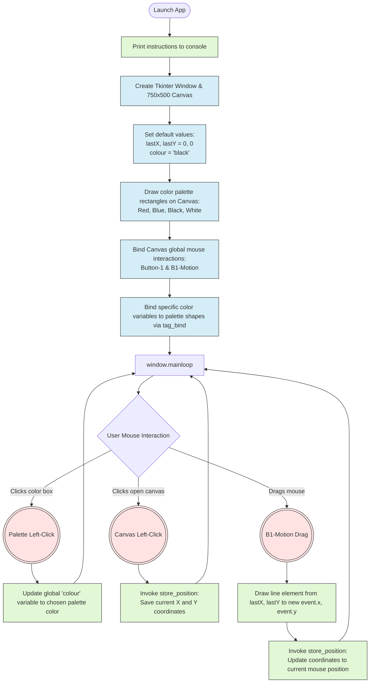

This is simple desktop drawing editor in Python with tkinter module

The logic of the program:

```mermaid
flowchart TD
    %% Define distinct visual styles for scannability
    classDef init fill:#d4edf7,stroke:#333,stroke-width:1px;
    classDef event fill:#ffe3e3,stroke:#333,stroke-width:1px;
    classDef action fill:#e1f7d5,stroke:#333,stroke-width:1px;

    %% Initialization Stage
    Start([Launch App]) --> PrintInstructions[Print instructions to console]
    PrintInstructions --> InitWindow[Create Tkinter Window & 750x500 Canvas]
    InitWindow --> InitGlobals[Set default values:<br>lastX, lastY = 0, 0<br>colour = 'black']
    
    %% Create UI Elements
    InitGlobals --> DrawPalettes[Draw color palette rectangles on Canvas:<br>Red, Blue, Black, White]
    DrawPalettes --> BindCanvas[Bind Canvas global mouse interactions:<br>Button-1 & B1-Motion]
    BindCanvas --> BindPalettes[Bind specific color variables to palette shapes via tag_bind]
    BindPalettes --> MainLoop[window.mainloop]

    %% Runtime Triggers
    MainLoop --> UserAction{User Mouse Interaction}

    %% Path A: Color Swapping
    UserAction -->|Clicks color box| TagEvent(((Palette Left-Click)))
    TagEvent --> ChangeColor[Update global 'colour' variable to chosen palette color]
    ChangeColor --> MainLoop

    %% Path B: Canvas Interactions
    UserAction -->|Clicks open canvas| ClickEvent(((Canvas Left-Click)))
    ClickEvent --> CallStore[Invoke store_position:<br>Save current X and Y coordinates]
    CallStore --> MainLoop

    UserAction -->|Drags mouse| DragEvent(((B1-Motion Drag)))
    DragEvent --> DrawLine[Draw line element from lastX, lastY to new event.x, event.y]
    DrawLine --> UpdatePos[Invoke store_position:<br>Update coordinates to current mouse position]
    UpdatePos --> MainLoop

    %% Apply Classes for visual anchors
    class InitWindow,InitGlobals,DrawPalettes,BindCanvas,BindPalettes init;
    class TagEvent,ClickEvent,DragEvent event;
    class PrintInstructions,ChangeColor,CallStore,DrawLine,UpdatePos action;
```
